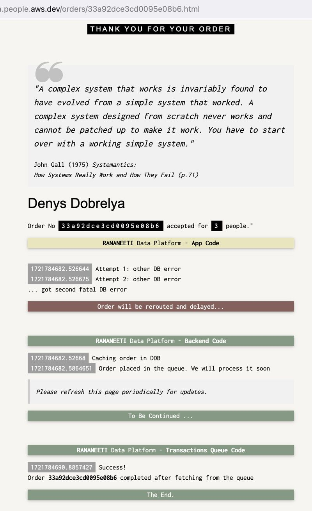
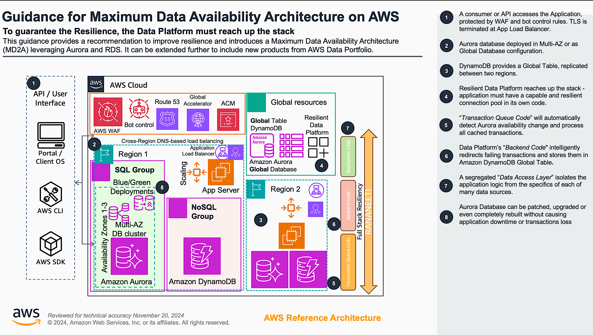
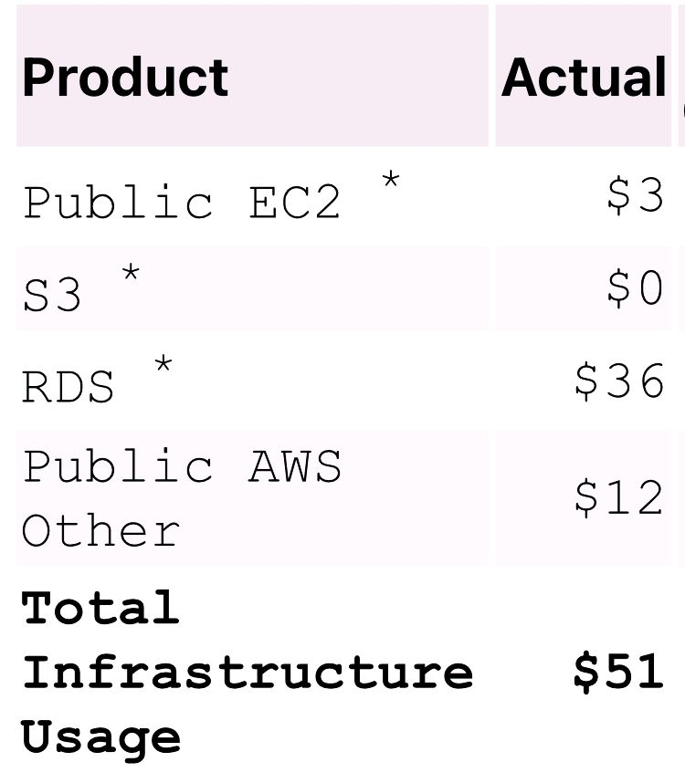
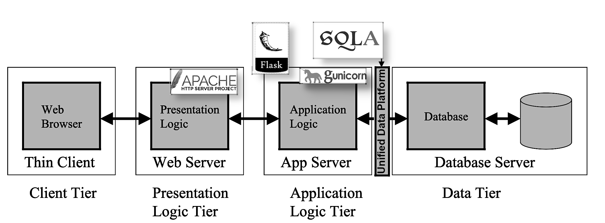
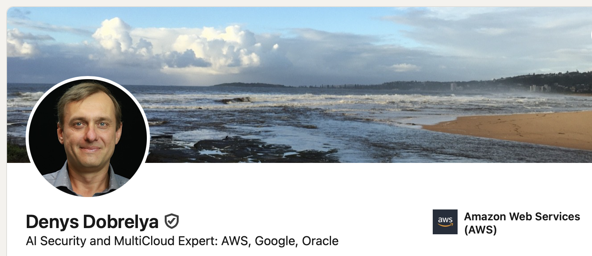

# Guidance for Maximum Data Availability Architecture on AWS
## (aka "MD2A" and "Rananeeti")

## Table of Content
1. [Overview](#overview)
    - [Cost](#cost)
2. [Background](#background)
3. [Cafe Demo App deployment process](#cafe-demo-app-deployment-process)
    - [Prepare the account](#prepare-the-account)
    - [Deploy Web and App Infrastructure](#deploy-web-and-app-infrastructure)
    - [DB Server](#db-server)
    - [Web Server](#web-server)
    - [App Server](#app-server)
4. [End of Deployment](#end-of-deployment)
5. [Cleanup](#cleanup)
6. [Notices](#notices)
7. [Author](#author)

## Overview
MD2A uses Aurora Global and Dynamo databases, Intelligent-Tiering S3 storage, global traffic management, application firewall and balancing infrastructure. These services, via their own programming APIs and SDKs, get engaged as necessary by our new _“Rananeeti”_ Data Platform which can deliver the _"Full Stack Resiliency"_, working with Application _in its entirety_, covering User Interface, Services and Database layers, as presented in the [Reference Architecture](#ArchDiag) diagram.

### What are we deploying?
The main idea is to _make your application resilient to database failures_.
This is how it looks like for our Cafe Demo Application:
<!-- (link to your URL) -->
<!-- https://www.markdownguide.org/basic-syntax/ -->

The video, detailed explanations and build guide follow.

### Architecture Diagram

The fully deployed production grade system have structure, similar to this:

Aurora Global Database and Amazon DynamoDB are powerful tools that can significantly enhance operational excellence by 1/ _replicating data_ across multiple Availability Zones and _Regions_; 2/ maintaining  continuous operations and _minimizing downtime_; 3/ _automating_ many database management tasks, such as backups, patching, and failover; 4/ with its high-performance storage engine, Aurora Global Database delivers low-latency performance, improving application responsiveness and providing _cross-regional availability_ at the same time; 5/ DynamoDB is a _fully managed_ NoSQL database that eliminates the need for database administration; 6/ DynamoDB _Global Tables_ enable low-latency access to data from multiple regions, which is ideal for applications with _global users_ and improves user experience.

### Cost
You are responsible for the cost of the AWS services used while running this Guidance. As of December 2024 _my cost_ of running this Guidance in the _us-east-1_ region is approximately _$55_ per month. \
 \
_Your cost may and will vary_.

## Background
You can read about *Application-level Resiliency* on 
[my LinkedIn page](https://www.linkedin.com/in/denys-dobrelya/):
- [Working Demo Application walkthrough](https://www.linkedin.com/posts/activity-7222454561465073664-metD), full resolution video is available upon request
- [Reference Architecture](#ArchDiag) diagram, describing all moving parts
- Main ideas behind "*Maximum Data Availability Architecture*" (MD2A):
   - [Building Resilient Applications: Leveraging Modern Databases for High Availability](https://www.linkedin.com/pulse/building-resilient-applications-leveraging-modern-high-denys-dobrelya-pcpqf)
   - [Building for the Future: Why Your Applications Need a Data Platform Foundation](https://www.linkedin.com/pulse/building-future-why-your-applications-need-data-denys-dobrelya-uzhaf)
   - [Business Summary: Deploying Aurora as a Global Cross-Region Database](https://www.linkedin.com/pulse/business-summary-deploying-aurora-global-cross-region-denys-dobrelya-o4wpf)
   - [Multi-Region Resilient Application Recipe](https://www.linkedin.com/pulse/multi-region-resilient-application-recipe-denys-dobrelya-cwjrf)
   - [Building a Cloud Fortress](https://www.linkedin.com/pulse/building-cloud-fortress-denys-dobrelya-b30wf)
- [Fully functional Cafe Demo website](https://cafe.olddba.people.aws.dev) is still available,
but we were asked to restrict public access. If you want to try it - let me know! 
(_It looks and works exactly like in my video above._)

## Cafe Demo App deployment process
By leveraging cloud computing and AWS managed services, _“Rananeeti” can reduce its carbon footprint_ significantly. AWS data centers are highly energy-efficient, utilizing advanced cooling technologies and renewable energy sources. AWS is committed to sustainable practices, such as reducing waste and optimizing resource usage.

### Learn Enough Command Line to Be Dangerous
> A software engineer spends months crafting a complex AI system. Finally, it's ready to deploy. The client, thrilled, asks, _"Can you show me a screenshot of it working?"_ The engineer sighs, _"Sure, here's a picture of my computer screen with the AI running in the background."_

I promise not to insult your intelligence with unnecessary dozen of screenshots "how to add my IP to SecGroup". I hope we are on the same page here.

### Prepare the account
-  Get new AWS Account. \
   So you don't mess up your things at work!
-  Use N.Virginia "us-east-1" region. \
   You may use any region you wish, but then you need to change the default value of CloudFormation parameter "HostAMI".
-  Create a KeyPair and name it "cafe-keypair" or provide your own name as CloudFormation parameter "CafeKey".
-  Run the CloudFormation (CF from now) and deploy the stack "Cafe". \
   Use file "deployment/Cafe_template.yaml". \
   Aurora DB creation takes the longest time - be patient for about 15 min. \
   Once everything is ready read the "Output" section and add your own IP to the Security Group.
- Connect to EC2 via ssh using your KeyPair. \
   This is your Application server and all Flask App code will be deployed here. \
   It is already configured to connect to empty Aurora PG database, just run "psql" from command line. \
   This Git Repo code had already been cloned into "/home/ec2-user/md2a/rananeeti/olddba". \
   Go there.
- Now we need to deploy [this target stack](https://www.linkedin.com/pulse/building-resilient-applications-leveraging-modern-high-denys-dobrelya-pcpqf).

This image "maps" old (but not useless!) "legacy" Enterprise world to newer lightweight approach.

### Deploy Web and App Infrastructure
- As "ec2-user" install necessary Python modules:
<pre>
- $ pip3 install boto3 oauthlib Flask Flask-SQLAlchemy Flask-OAuthlib Gunicorn psycopg2-binary
</pre>
- Configure AWS CLI credentials.
The recommended practice is to use [IAM Identity Center authentication](https://docs.aws.amazon.com/cli/latest/userguide/cli-configure-sso.html).
<pre>
- $ cd ~
- $ aws configure
AWS Access Key ID [None]: Key-from-your-IAM-User
AWS Secret Access Key [None]: Secret-from-your-IAM-User
Default region name [None]: us-east-1
Default output format [None]: text
$ aws s3 ls
    2024-11-26 05:14:32 cf-templates-1j84y89c4zr7w-ap-southeast-2
    2024-11-26 06:42:48 cf-templates-1j84y89c4zr7w-us-east-1
</pre>

### DB Server
- As "ec2-user", connect to Aurora DB from the App Server.
<pre>
- psql
  cafedb=> \c
psql (15.8, server 15.4)
SSL connection (protocol: TLSv1.3, cipher: TLS_AES_256_GCM_SHA384, compression: off)
You are now connected to database "cafedb" as user "postgres".
  cafedb=>  create user cafeapp password 'Welcome1';
  cafedb=>  grant all on database cafedb to cafeapp; 
  cafedb=> \c cafedb cafeapp
psql (15.8, server 15.4)
SSL connection (protocol: TLSv1.3, cipher: TLS_AES_256_GCM_SHA384, compression: off)
You are now connected to database "cafedb" as user "cafeapp".
  cafedb=>  create schema cafe authorization cafeapp;
  cafedb=>  create table cafe.ordersraw(
             ordrid SERIAL PRIMARY KEY,
             ordrdgst char(20) UNIQUE NOT NULL, -- blake2b hash digest value
             ordrname varchar(40) NOT NULL, -- who ordered
             ordrppl integer NOT NULL, -- how many people to attend
             ordrdttm timestamp(0) NOT NULL, -- Date / Time no TZ no Seconds
             ordrtxt varchar(200) -- Optional notes
    );
</pre>

### Web Server
- Become root on your EC2 App Server.
<pre>
- # cd /
- # tar xzvpf /home/ec2-user/md2a/rananeeti/olddba/assets/v1.1.tgz # Please preserve permissions with "p"!
- # cd ~
- # apachectl start
- # apachectl status
   .... should see workers
- # systemctl enable httpd.service  # So it will restart after reboot.
</pre>
- From your workstation open in Firefox your EC2 host address.
You should see "home Cafe" landing webpage, delivered over plain HTTP. Setting up your own domain with Route53 and registering all necessary certificates to terminate TLS at ELB is beyond scope of this demo.  [My Demo website]( https://cafe.olddba.people.aws.dev) provides that functionality and Customer workshop may be organised to review full details.

### App Server
- Continue as root
<pre>
- # pip3 install gunicorn
- # systemctl enable gunicorn
- # systemctl start gunicorn
- # systemctl status gunicorn
   .... should see workers
- # systemctl enable rananeeti_tx_cache
- # systemctl start rananeeti_tx_cache
- # systemctl status rananeeti_tx_cache
   .... should see "Started rananeeti_tx_cache.service - RANANEETI Caching layer."
</pre>

## End of Deployment
From your workstation open in Firefox your EC2 host address and start making "reservations", while ticking the checkbox to test Database failures. (You may consider to temporarily disable JS so you can go back and resubmit same data without changing anything.)

Now it's a good time to play around with the cafe Demo website and to review its code. Note that "Rananeeti" Data Platform is the _only interface_ to all sort of data stores, relational and not. It also has its own connection pool with transaction processing logic smart enough to survive even full database outages. _That is the core concept of Maximum Data Availability Architecture_.

> Thank you for visiting! 

## Cleanup
### Delete Stack
To clean up environment, AWS resources can be deleted using CloudFormation - you can go to the CloudFormation stack and click `Delete`. This process shall fully cleanup all deployed and provisioned services. It's time to destroy the account too - remember, we created it only for the purpose of running this demo? Please follow this approach when you experiment with AWS Cloud Services - it's the best way to avoid unnecessary billing suprises.

## Notices
**Copyright Notice:**
<i>Please note that the software components of the software stack deployed for this demo, including Linux, Apache HTTP Server, Gunicorn and Python libraries, may be licensed under the GNU General Public License version 3 (GPLv3) and may be not suitable for Commercial use. Please do your own legal research. For specific licensing inquiries or commercial use, please consult the official GPLv3 license text and consider contacting the respective copyright holders.</i>

**Legal Disclaimer:**
<i>Customers are responsible for making their own independent assessment of the information in this Guidance. This Guidance: (a) is for informational purposes only, (b) represents AWS current product offerings and practices, which are subject to change without notice, and (c) does not create any commitments or assurances from AWS and its affiliates, suppliers or licensors. AWS products or services are provided “as is” without warranties, representations, or conditions of any kind, whether express or implied. AWS responsibilities and liabilities to its customers are controlled by AWS agreements, and this Guidance is not part of, nor does it modify, any agreement between AWS and its customers.</i>

## Author
- [Denys Dobrelya](https://www.linkedin.com/in/denys-dobrelya/) - Principal Specialist Solutions Architect

